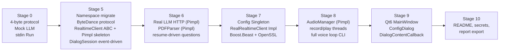
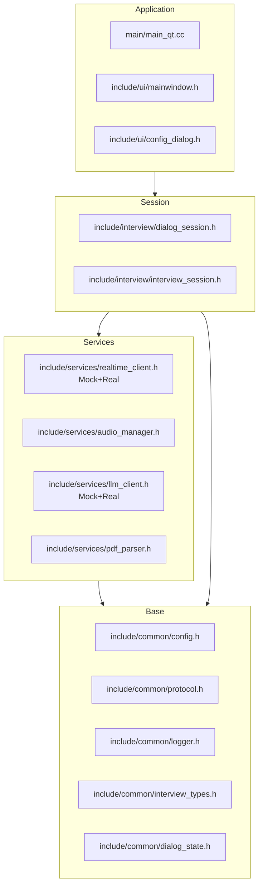

## 总目标

按设计文档（[doc/AI面试.pdf](doc/AI面试.pdf)）落地 4 层架构：UI → 会话层（DialogSession + InterviewSession）→ 服务层（RealtimeClient + AudioManager + LLMClient + PDFParser）→ 基础层（Config + Protocol + Logger + Utils），最终能从 PDF 简历出题、真实豆包 WSS 跑完整语音面试、Qt 界面展示。

## 风格守则（贯穿所有阶段）

- 文件后缀 `.cc` / 头文件 `.h`。
- **namespace**：统一用 `interview::common / interview::services / interview::session / interview::ui`（对齐参考项目）。阶段 5 一次性把所有现存文件迁完，之后新文件直接落到对应 namespace。
- **Pimpl**：仅在"重型第三方依赖会泄漏到 header"的实体类上用 —— `RealRealtimeClient`（Boost.Beast + OpenSSL）、`AudioManager`（PortAudio）、`PDFParser`（PoDoFo）、`RealLLMClient`（libcurl）。抽象基类、`Mock*` 实现、业务层（`InterviewSession / DialogSession`）、基础层（`Config / Protocol / Logger`）保持普通类，不上 Pimpl。
- **Singleton**：仅 `Config` 用（阶段 7 改造时引入），其他类不引入。
- 复用你现有"抽象基类 + `Mock*` + `Real*` 双实现"模式（已用在 `LLMClient`），扩展到 `RealtimeClient`。
- 私有成员后缀 `_`，spdlog 宏 `LOG_INFO/LOG_WARN/...`。
- CMake 用 `COMMON_SOURCES / SERVICES_SOURCES / INTERVIEW_SOURCES / MAIN_SOURCES` 变量分组（沿用 [CMakeLists.txt](CMakeLists.txt) 现有写法）。
- 顺手修两个错别字（阶段 5 接口重整时一并改）：`MessageType::kAuidoData` → `kAudioData`、`RealTimeClient::SenMessage` → `SendMessage`、类名 `RealTimeClient` → `RealtimeClient`。

### Namespace 落位

- `include/common/*`、`src/common/*` → `interview::common`
- `include/services/*`、`src/services/*` → `interview::services`
- `include/interview/*`、`src/interview/*` → `interview::session`
- `include/ui/*`、`src/ui/*`（阶段 9 才出现） → `interview::ui`
- `main/*.cc` 不放 namespace；内部用 `using namespace interview;` 简写

## 豆包 API 参考资料（贯穿阶段 5/7/8）

阶段 5（协议）/ 阶段 7（WSS）/ 阶段 8（音频）严格对齐下面这份官方文档：

- 主文档：[端到端实时语音大模型 API 接入文档](https://www.volcengine.com/docs/6561/1594356) —— 协议字节布局、事件 ID、StartSession payload schema、错误码全在这里。
- 关键握手参数（写进 [config/default_config.json](config/default_config.json) 的 `ws.headers`）：
  - `X-Api-App-Key` = **固定值** `PlgvMymc7f3tQnJ6`（不是用户的 App Key）
  - `X-Api-App-ID`、`X-Api-Access-Key` = 控制台分配，取自 [doc/AI面试.pdf](doc/AI面试.pdf) 第 9 页
  - `X-Api-Resource-Id` = `volc.speech.dialog`
  - `X-Api-Connect-Id` = 客户端生成 UUID（连接级唯一）
  - `Authorization: Bearer; {access_token}`（注意 `Bearer` 后是分号 + 空格，非标准 OAuth）
- WSS URL：`wss://openspeech.bytedance.com/api/v3/realtime/dialogue`
- 音频硬约束：
  - 客户端上传（TaskRequest payload）：PCM / 单声道 / 16000 Hz / int16 / **小端序**。
  - 服务端 TTS：默认返回 OGG/Opus，必须在 `StartSession` 的 `tts.audio_config` 显式指定 `format=pcm, sample_rate=24000` 才能拿到 PCM（你 default_config.json 已经这么配）。

## 当前状态（更新于代码再扫描后）

### 阶段 0（最早完成）

- 文本面试逻辑完整：[include/interview/interview_session.h](include/interview/interview_session.h) + [src/interview/interview_session.cc](src/interview/interview_session.cc)
- 状态机 + std::cin 文本 Run：[src/interview/dialog_session.cc](src/interview/dialog_session.cc)
- LLMClient 抽象 + Mock + Real 骨架（Real 还在用 fallback 题目）：[include/services/llm_client.h](include/services/llm_client.h)、[src/services/real_llm_client.cc](src/services/real_llm_client.cc)
- vcpkg 依赖已经备齐（`portaudio / podofo / qtbase / boost-beast / openssl / curl / spdlog / nlohmann-json / zlib`）：[vcpkg.json](vcpkg.json)

### 阶段 5 已完成的子任务（约 60% 进度）

- ✅ **namespace 三层迁移全部完成**：[include/common/](include/common/) → `interview::common`、[include/services/](include/services/) → `interview::services`、[include/interview/](include/interview/) → `interview::session`，对应 `.cc` 全部同步。`LOG_*` 宏改成 `::interview::common::Logger::Get()` 全限定形式，跨 namespace 调用没问题。
- ✅ **MessageType 改对了**：[include/common/protocol.h](include/common/protocol.h) 老的 `kClientEvent / kServerEvent / kAuidoData / kError` 已替换为 `kClientFullRequest / kClientAudioOnlyRequest / kServerFullResponse / kServerAck / kServerErrorResponse`（沿用参考项目命名 `kServerAck`，不强行改成官方名 `Audio-only response`）。
- ✅ **新增枚举/结构**：`MessageFlags`（`kNoSequence / kProSequence / kNegSequence / kMsgWithEvent`）、`CompressionType`（`kNone / kGzip / kCustom`）、`SerializationType` 扩展（`kThrift / kCustom`）、`ParsedResponse`（`event / session_id / connect_id / payload_json / payload_bytes / payload_size / code / is_binary`）。
- ✅ **事件 ID 表完整对齐官方**：`namespace events` 下 `kStartConnection=1 ... kSessionFailed=153 ... kTaskRequest=200 ... kChatTextQuery=500 ... kTtsResponse=352 ... kAsrInfo=450 ... kAsrResult=451 ... kAsrEnded=459 ... kChatResponse=550 / kChatEnded=559`。
- ✅ **`Protocol::BuildFullRequest` 已声明**（[include/common/protocol.h](include/common/protocol.h) L171）。
- ✅ **新主入口 [main/test.cc](main/test.cc)**：CMake `MAIN_SOURCES` 已切到它，默认走 `RealLLMClient` + 旧 `RealTimeClient` 占位。

### 阶段 5 还没做、且当前已经引入编译错误 / 协议矛盾的项

进入阶段 5 余下任务之前**必须先解决**，否则项目编译跑不通。

- ⚠️ **协议线上字节布局三处自相矛盾**（最关键）：
  - [include/common/protocol.h](include/common/protocol.h) L26：`kProtocolHeaderBytes = 6`（注释 "4->6"）。
  - [src/common/protocol.cc](src/common/protocol.cc) L57-66 的 `Encode()` 实际只 push 了 4 个字节（Byte0=ver|hdr_size, Byte1=msg_type 整字节, Byte2=flags 整字节, Byte3=serialization 整字节），既没按 6 字节也没按官方 packed。
  - Decode 用 `kProtocolHeaderBytes=6` 偏移读 payload_size，Encode 只写 4 字节头 → **Encode 出来的 byte stream 自己 Decode 不回来**。
  - **决议**：按官方 4 字节 packed 重写（已确认）。具体见下面"阶段 5 余下任务清单"。
- ⚠️ **[src/interview/dialog_session.cc](src/interview/dialog_session.cc) 编译不过**：
  - L167-187 的 `OnRealTimeMessage` switch 在已经被删除的 `MessageType::kServerEvent / kAuidoData / kError` 上。
  - L196-216 / L222-249 的 `SendHelloMessage` / `SimulateIncomingMessage` 用了已删除的 `MessageType::kClientEvent`，且 `message.header.flags = 0` 给 `MessageFlags` 枚举赋整型 `0`（C++ 强类型 enum 不允许）。
- ⚠️ **[main/test.cc](main/test.cc) L49 配置 bug**：`std::make_unique<RealTimeClient>(config.llm.api_url)` 把 LLM URL 传给实时层了，应该是 `config.ws.base_url`。
- ⚠️ **三个错别字还没改**：类名 `RealTimeClient` → `RealtimeClient`、方法 `SenMessage` → `SendMessage`、成员 `messgae_handler_` → `message_handler_`。`MessageFlags::kProSequence`（应为 `kPosSequence`，positive sequence）建议同步修。
- ⚠️ **`Protocol::BuildClientAudioRequest / ParseResponse / CompressGzip / DecompressGzip` 还没声明**。
- ⚠️ **RealtimeClient 还是单一占位类**，没拆成抽象 + Mock + 空 Real(Pimpl)。

## 阶段 5：namespace 迁移 + 协议 + 实时层接口一次性对齐（核心衔接点）

**目的**：把后续所有"接口要换样子"和"全局风格调整"的事情压到这一步，再往后只填实现，不改签名。

### Namespace 一次性迁移（所有现存文件）—— ✅ 已完成

实际状态见上面"阶段 5 已完成的子任务"。`main/test.cc` 已经用 `using namespace interview::common; using namespace interview::services; using namespace interview::session;` 三段写法，跟 plan 原定的 `using namespace interview;` 略不同但效果一致，保留现状。

### 协议升级（[include/common/protocol.h](include/common/protocol.h) / [src/common/protocol.cc](src/common/protocol.cc)，部分完成）

#### 字节布局（已决议：官方 4 字节 packed）

严格按官方文档（[docs/6561/1594356](https://www.volcengine.com/docs/6561/1594356) §2.2）：

- **Header 固定 4 字节**，8 个 4bit 字段两两打包：

  | Byte | 高 4 bit | 低 4 bit |
  |---|---|---|
  | 0 | `version` (=0b0001) | `header_size` (=0b0001 表示 header = 1×4 = 4 字节) |
  | 1 | `message_type` | `message_type_specific_flags` |
  | 2 | `serialization` | `compression` |
  | 3 | `reserved`（整字节） | — |

- **Optional 段位于 header 之后、payload 之前**，顺序固定为：`[code(4B, 错误帧)] [sequence(4B)] [event(4B)] [connect_id_size(4B) + connect_id] [session_id_size(4B) + session_id]`。然后才是 `[payload_size(4B)] [payload]`。所有多字节整数走大端。

#### 已落地的常量（沿用代码现状的命名）

- `MessageType`：`kClientFullRequest=0b0001 / kClientAudioOnlyRequest=0b0010 / kServerFullResponse=0b1001 / kServerAck=0b1011 / kServerErrorResponse=0b1111`（注意保留 `kServerAck` 命名，不改）。
- `MessageFlags`：`kNoSequence / kProSequence / kNegSequence / kMsgWithEvent`（建议把 `kProSequence` 改成 `kPosSequence` 拼写更准；如果不改保持现状也行）。
- `SerializationType`：`kNone=0b0000 / kJson=0b0001 / kThrift=0b0011 / kCustom=0b1111`。
- `CompressionType`：`kNone=0b0000 / kGzip=0b0001 / kCustom=0b1111`。
- `events`（子 namespace）：`kStartConnection=1 / kFinishConnection=2 / kConnectionStarted=50 / kConnectionFailed=51 / kConnectionFinished=52 / kStartSession=100 / kFinishSession=102 / kSessionStarted=150 / kSessionFinished=152 / kSessionFailed=153 / kTaskRequest=200 / kChatTextQuery=500 / kTtsSentenceStart=350 / kTtsSentenceEnd=351 / kTtsResponse=352 / kTtsEnded=359 / kAsrInfo=450 / kAsrResult=451 / kAsrEnded=459 / kChatResponse=550 / kChatEnded=559`。

#### `ParsedResponse` 已落地字段（[include/common/protocol.h](include/common/protocol.h) L136-146）

`event(uint32_t) / session_id(string) / connect_id(string) / payload_json(string) / payload_bytes(vector<uint8_t>) / payload_size(size_t) / code(int32_t) / is_binary(bool)`。

注意现状 `payload_json` 类型是 `std::string`（不是 `nlohmann::json`），方便外面自由 parse；这跟原 plan 不一样，保留现状。如果后续 DialogSession 用得多再考虑改 `nlohmann::json`。

#### `Protocol` 静态方法清单（部分已声明，部分要补）

- ✅ `BuildByte0 / ExtractVersion / ExtractHeaderSize / AppendUint32 / ReadUint32 / Encode / Decode`（已实现，但 Encode/Decode 字节布局**要按 4 字节 packed 重写**）。
- ✅ `BuildFullRequest` 已声明（[include/common/protocol.h](include/common/protocol.h) L171）。
- ❌ `BuildClientAudioRequest(event, session_id, pcm) -> bytes`：要补声明 + 实现。msg_type=ClientAudioOnlyRequest, ser=kNone, payload=PCM 原始字节。
- ❌ `ParseResponse(data) -> ParsedResponse`：要补声明 + 实现。按 flags + msg_type 解析 optional 段；`kServerAck` 把 payload 写 `payload_bytes` 并 `is_binary=true`；`kServerErrorResponse` 读 `code`。
- ❌ `CompressGzip / DecompressGzip`（用 vcpkg 的 `zlib`）：当前默认不压缩，但要能解 gzip 以兼容服务端大 payload。

#### 阶段 5 余下任务清单（按文件）

| 文件 | 具体改动 |
|---|---|
| [include/common/protocol.h](include/common/protocol.h) | `kProtocolHeaderBytes` 改 `4`；补 `BuildClientAudioRequest / ParseResponse / CompressGzip / DecompressGzip` 声明；`AppendUint32 / ReadUint32` 重命名为 `AppendUint32BigEndian / ReadUint32BigEndian`；建议把 `kProSequence` 改 `kPosSequence`。 |
| [src/common/protocol.cc](src/common/protocol.cc) | **重写 `Encode` / `Decode`** 为 4 字节 packed：Byte1=`(msg_type<<4)\|flags`、Byte2=`(ser<<4)\|compression`、Byte3=`reserved`。实现 `BuildFullRequest`（含 event 4B + session_id_size 4B + session_id + payload_size 4B + payload_json_utf8）、`BuildClientAudioRequest`（同上但 ser=Raw、payload 是 PCM）、`ParseResponse`（按 flags 判断是否读 code/sequence/event/connect_id/session_id）、`CompressGzip / DecompressGzip`（CMake 加 `find_package(ZLIB REQUIRED)` + 链接 `ZLIB::ZLIB`）。 |
| [include/services/realtime_client.h](include/services/realtime_client.h) + [src/services/realtime_client.cc](src/services/realtime_client.cc) | 1）类名 `RealTimeClient` → `RealtimeClient`，方法 `SenMessage` → `SendMessage`，成员 `messgae_handler_` → `message_handler_`。2）改为抽象基类，接口签名按之前 plan 定的（`SendEvent / SendAudio / SetEventHandler`，回调改 `EventHandler = std::function<void(const ParsedResponse&)>`）。3）新增 [include/services/mock_realtime_client.h](include/services/mock_realtime_client.h) + `.cc`：注入 `std::vector<ParsedResponse>` 脚本，`Connect()` 起工作线程按序投递。4）新增 [include/services/real_realtime_client.h](include/services/real_realtime_client.h) + `.cc`：**Pimpl 形式骨架**，`Impl` 现阶段全部返回 `false` / no-op；阶段 7 再填真实 WSS。 |
| [src/interview/dialog_session.cc](src/interview/dialog_session.cc) | 1）`OnRealTimeMessage(ProtocolMessage)` 改成 `OnServerEvent(const ParsedResponse&)`，按 `event` 分支处理（`kConnectionStarted/kSessionStarted/kTtsResponse/kTtsEnded/kAsrInfo/kAsrResult/kAsrEnded/kSessionFinished` + `is_error` 分支）。2）累积 `kAsrResult` 文本到 `current_asr_text_`，`kAsrEnded` 时提交给 `InterviewSession::SubmitAnswer()`。3）`SendHelloMessage / SimulateIncomingMessage` 删除（移到 mock 实时层脚本里）。4）`Run()` 拆 `RunFromStdin()`（保留）+ `RunEventDriven()`（等事件）。 |
| [include/interview/dialog_session.h](include/interview/dialog_session.h) | 改持有 `std::unique_ptr<RealtimeClient>`（基类），构造参数同步；新增 `OnServerEvent` 私有方法、`current_asr_text_` 缓冲。 |
| [main/test.cc](main/test.cc) | 1）修 L49 bug：传 `config.ws.base_url` 而不是 `config.llm.api_url`。2）改用 `MockRealtimeClient` + 脚本化事件序列（`CONNECTION_STARTED → SESSION_STARTED → ASR_RESULT × 3 → SESSION_FINISHED`）跑通新状态机。 |
| [CMakeLists.txt](CMakeLists.txt) | `SERVICES_SOURCES` 加 `mock_realtime_client.cc / real_realtime_client.cc`；加 `find_package(ZLIB REQUIRED)` + 链接 `ZLIB::ZLIB`。 |

### RealtimeClient 抽象 + Mock + 空 Real（细节）

抽象基类（在 `interview::services` 下）：

```cpp
namespace interview::services {

class RealtimeClient {
 public:
  using EventHandler =
      std::function<void(const interview::common::ParsedResponse&)>;
  virtual ~RealtimeClient() = default;
  virtual bool Connect() = 0;
  virtual void Close() = 0;
  virtual bool SendEvent(uint32_t event, const std::string& session_id,
                         const nlohmann::json& payload) = 0;
  virtual bool SendAudio(const std::string& session_id,
                         const std::vector<uint8_t>& pcm) = 0;
  virtual void SetEventHandler(EventHandler handler) = 0;
  virtual bool IsConnected() const = 0;
};

}  // namespace interview::services
```

- `MockRealtimeClient`（普通类，不上 Pimpl）：构造时注入 `std::vector<ParsedResponse>` 脚本 + 投递间隔，`Connect()` 后开一个 std::thread 按序 `message_handler_(...)`，`Close()` 时 `join`。
- `RealRealtimeClient`（**Pimpl 骨架**，阶段 5 只到 no-op）：头文件 `class Impl; std::unique_ptr<Impl> impl_;`，`.cc` 里 `Impl` 所有方法返回 `false`/no-op。阶段 7 才填真实 WSS，头文件不动。

### DialogSession 事件驱动改造（细节）

`OnRealTimeMessage(ProtocolMessage)` → `OnServerEvent(const ParsedResponse&)`，按 `event` 分支处理：

- `kConnectionStarted / kSessionStarted` → 状态 `kConnecting` → `kIdle`
- `kTtsSentenceStart / kTtsResponse` → 状态 `kInterviewerSpeaking`（阶段 8 由播放线程消费 PCM）
- `kTtsEnded` → 状态切回 `kIdle`
- `kAsrInfo` → 状态 `kCandidateSpeaking`（首字检测，可提前打断播放）
- `kAsrResult` → 累积文本到 `current_asr_text_`
- `kAsrEnded` → 状态 `kInterviewerThinking`，把 `current_asr_text_` 提交给 `InterviewSession::SubmitAnswer()`，根据结果生成下一步动作（`kChatTextQuery` 把追问 / 下一题文本发给 TTS）
- `kSessionFinished` → 状态 `kCompleted`
- 任意 `is_binary=false` 且 msg_type 为 `kServerErrorResponse` 的帧（即 `code != 0`） → `LOG_ERROR` + 状态 `kStopped`

`Run()` 拆成：`RunFromStdin()`（保留给老 demo 文本模式）+ `RunEventDriven()`（阻塞等 `kSessionFinished` 或 `Stop()`）。

### 阶段 5 接口冻结点

- 全代码库已经在 `interview::*` 下，后续不再做大规模 namespace 调整。
- `Protocol::BuildFullRequest / BuildClientAudioRequest / ParseResponse` 签名固定。
- `RealtimeClient` 抽象基类签名固定 + `RealRealtimeClient` 头文件（含 Pimpl 形式）固定，阶段 7 只动 `.cc` 里的 `Impl`。
- `DialogSession::OnServerEvent(const ParsedResponse&)` 签名固定（阶段 6/7/8 不再动）。

## 阶段 6：真 LLM 接通 + PDF 简历

**目的**：让 `RealLLMClient::GenerateQuestions` 真正调小马算力 API，把当前 fallback 替换掉；把"简历驱动"链路打通。所有改动只在 services/ 内部，不动会话层。

- 完成 [src/services/real_llm_client.cc](src/services/real_llm_client.cc) 三个接口（已经有 prompt/parse 骨架）：
  - `GenerateQuestions`：构造 prompt → libcurl POST → 解析 JSON → 失败 fallback 到 `BuildDefaultQuestions`。
  - `EvaluateAnswer`：完善 `BuildEvaluatePrompt` + `ParseEvaluateResult`，要求 LLM 返回固定 JSON schema（`{score, need_followup, followup_question, feedback}`）。
  - `GenerateSummary`：同上，返回纯文本。
  - **`RealLLMClient` 改造为 Pimpl**：libcurl 句柄/HTTP buffer/重试上下文都收进 `class Impl;`，header 不再 `#include <curl/curl.h>`。`MockLLMClient` 维持普通类。集中 HTTP 逻辑到 `Impl::HttpPostJson(url, headers, body)`，阶段 7 `RealRealtimeClient::Impl` 不复用它（WSS 走 Beast，不走 curl），但保留为内部工具。
- 新增 [include/services/pdf_parser.h](include/services/pdf_parser.h) + [src/services/pdf_parser.cc](src/services/pdf_parser.cc)：直接做实体类，**用 Pimpl** 把 PoDoFo 的 `PdfMemDocument` 等头藏到 `.cc`。对外接口只两个 `bool IsValidPDF(const std::string& path)` / `std::string ExtractText(const std::string& path)`。
- `InterviewSession` 增加可选构造参数 `resume_text`（默认空），`Start()` 把它传给 `llm_client_->GenerateQuestions(resume_text, "C++ 工程师", n)`。**不改老接口**，新增带默认值参数或重载。
- 新 demo `main/interview_text_pipeline_main.cc`：PDF → RealLLMClient 出题 → DialogSession + MockRealtimeClient → 文本走完一场（用脚本化 ASR_RESULT 模拟回答）。
- CMake 加 `find_package(podofo CONFIG REQUIRED)` + `podofo::podofo` 链接。

### 阶段 6 接口冻结点

- `LLMClient` 三接口（已经稳定，不动）。
- `PDFParser` 两接口固定。

## 阶段 7：真豆包 WSS 实时层 + Config Singleton 化

**目的**：把阶段 5 占位的 `RealRealtimeClient::Impl` 填进去；把 `Config` 重构成 Singleton 顺带补全 4 个 section。会话层和业务层完全不动。

### Config 改造为 Singleton（[include/common/config.h](include/common/config.h)）

- `Config` 改成 Singleton（`Config& Config::Instance();`，删除拷贝/赋值），所有字段（`ws / llm / dialog / asr / tts / audio_input / audio_output`）作为 public 成员暴露，对齐参考项目。
- 启动入口（main / Qt 入口）调用 `Config::Instance().LoadFromFile("config/local_config.json")`，失败 fallback 到 `default_config.json`。
- 老的 `LoadConfig(path) -> AppConfig` 自由函数**保留 6 个月作为兼容层**（内部转调 Singleton），新代码统一用 `Config::Instance()`。或者一刀切删掉，由你定 —— 我倾向直接删，因为还在你的项目早期，调用点只有 demo main，影响小。
- 新增 `AudioConfig / DialogConfig / TtsConfig / AsrConfig` 结构体（namespace `interview::common`）：
  - `AudioConfig`：`chunk / channels / sample_rate / bit_size / format`。
  - `DialogConfig`：`bot_name / system_role / speaking_style / city / strict_audit / audit_response / recv_timeout / input_mod`。
  - `TtsConfig`：`speaker / channel / format / sample_rate`（你 `default_config.json` 里已经有）。
  - `AsrConfig`：`end_smooth_window_ms / vad_silence_duration / vad_speech_trigger_duration`（已有）。
- `Config::BuildStartSessionPayload() const -> nlohmann::json`：把 `dialog/asr/tts` 三块打包成豆包要求的 JSON（参考项目 `Config::GenerateStartSessionRequest()`）。
- 在 `default_config.json` 补 `dialog` 段。

### RealRealtimeClient 实装（[src/services/real_realtime_client.cc](src/services/real_realtime_client.cc) 里的 `Impl`）

- 头文件不动（阶段 5 已经定型为 Pimpl）。所有 Boost.Beast / OpenSSL 头只在 `.cc` 里 include。
- `Impl` 持有：`boost::asio::io_context / ssl::context / websocket::stream<ssl::stream<tcp::socket>> / std::thread recv_thread_ / std::atomic<bool> running_ / EventHandler handler_ / std::mutex send_mutex_ / std::string session_id_`。
- `Connect()` 流程（对齐文档 §2 接入流程）：
  1. DNS resolve `openspeech.bytedance.com` → TCP connect 443。
  2. TLS 握手（OpenSSL `ssl::stream`，校验 SNI = `openspeech.bytedance.com`）。
  3. WS 升级到 `/api/v3/realtime/dialogue`，加 headers：
     - `X-Api-App-ID / X-Api-Access-Key / X-Api-Resource-Id` 从 `Config::Instance().ws.headers` 读；
     - `X-Api-App-Key` 用**固定值** `PlgvMymc7f3tQnJ6`；
     - `X-Api-Connect-Id` 空就调 boost UUID 生成；
     - `Authorization: Bearer; {access_token}`（注意是分号 + 空格，不是标准 OAuth 格式）。
  4. 发 `events::kStartConnection`（无 session_id，payload 是 `{}`）→ 阻塞等首帧 `events::kConnectionStarted`（带 connect_id）。
  5. 本地生成 `session_id_` (UUID) → 发 `events::kStartSession`（payload = `Config::Instance().BuildStartSessionPayload()`，含 `dialog/asr.extra/tts.audio_config`）→ 阻塞等 `events::kSessionStarted`。
  6. 启动接收线程 → 返回 true。
  7. 任意一步失败：`LOG_ERROR` + 关闭已建立的资源 + 返回 false。
- 接收线程循环：
  - `ws.read(buffer)` → 校验帧类型必须是 `binary`（豆包协议规定二进制传输，文本帧直接丢弃 + 警告）→ `Protocol::ParseResponse(buffer)` → 投递 `handler_(parsed)`。
  - peer close / partial recv 显式处理（贴 user rule "EAGAIN/EINTR/peer close/partial send/recv"）：
    - `boost::beast::error::closed`：peer 主动关，置 `running_=false` 退出循环（正常路径）。
    - `boost::asio::error::eof / connection_reset / operation_aborted`：日志 `LOG_WARN` 后退出。
    - `boost::beast::error::try_again` / `would_block`：等价 EAGAIN，短 sleep 1ms 后 continue。
    - 其它 `boost::system::error_code`：`LOG_ERROR` + 退出。
    - 任意抛出的异常被 catch 吞掉并 `LOG_ERROR`，不让线程逃出 io_context。
- `SendEvent / SendAudio`：`std::lock_guard<std::mutex> lock(send_mutex_)`，调 `Protocol::BuildFullRequest / BuildClientAudioRequest`，`ws.binary(true)` + `ws.write()`。失败返回 false 并打日志，不抛异常。Write 也要处理 EAGAIN（`try_again`）—— 短 sleep 1ms 重试一次，再失败就返回 false。partial send 由 Beast 自己保证（`write` 写完才返回），不用手工聚合。
- `Close()`（可重入）：先 CAS `running_=false`；发 `kFinishSession` → 等 `kSessionFinished`（带 3s 超时，过了直接进下一步）→ 发 `kFinishConnection` → `ws.close(websocket::close_code::normal)` → `recv_thread_.join()`。
- 新 demo `main/dialog_session_real_demo_main.cc`：真连豆包，候选人回答仍走 stdin（`RunFromStdin()`），AI 提问通过 `events::kChatTextQuery`（=500）让服务端 TTS 把文本读出来（验证文字链路 + TTS 音频流到达回调，但音频还不播）。
- CMake 加 `find_package(OpenSSL REQUIRED)` + `Boost::system Boost::thread` + `OpenSSL::SSL OpenSSL::Crypto`（`boost-beast` 头-only，自动被 boost-asio 拉到）。

### 阶段 7 接口冻结点

- `Config::Instance()` 形式 + 完整字段定型，后续 stage 不动。
- `Config::BuildStartSessionPayload()` 签名定型。
- `RealRealtimeClient::Impl` 实装完成，跑通文字往返 + TTS 音频流到达。

## 阶段 8：音频接入（PortAudio）

**目的**：把麦克风/扬声器接进来，端到端语音面试在命令行里就能跑通。

- 新增 [include/services/audio_manager.h](include/services/audio_manager.h) + [src/services/audio_manager.cc](src/services/audio_manager.cc)，落在 `interview::services` 下，**用 Pimpl** 把 PortAudio 的 `PaStream*`、`PaStreamParameters` 都藏到 `.cc`。对外接口：`OpenInputStream / OpenOutputStream / ReadAudio() -> std::vector<int16_t> / WriteAudio(const std::vector<float>&) / Cleanup`。构造函数从 `Config::Instance().audio_input / audio_output` 读参数，不显式传配置。
- 音频格式硬性约束（来自 [docs/6561/1594356](https://www.volcengine.com/docs/6561/1594356) §1.3）：
  - 客户端上传：PCM / 单声道 / 16000 Hz / int16 / **小端序**（PortAudio 的 `paInt16` 已经是 LE）。
  - 服务端 TTS 返回：24000 Hz / 单声道 / PCM（要求 StartSession 时 `tts.audio_config.format = "pcm"`，[config/default_config.json](config/default_config.json) 已经这么填）。
- DialogSession 内部新增两个工作线程：
  - **录音线程**：会话进入 `kIdle` 或收到 `events::kAsrInfo`（说话起首字）后开始录，循环 `ReadAudio()` → `RealtimeClient::SendAudio(session_id_, pcm)`（msg_type=ClientAudioOnlyRequest, event=`kTaskRequest`=200），每 ~10ms 一帧；收到 `events::kAsrEnded` 停录。
  - **播放线程**：从 `events::kTtsResponse`（ID=352，`payload_bytes` 是 24kHz PCM int16）拿数据，转 float32 入播放队列，`AudioManager::WriteAudio()` 输出。`events::kTtsEnded`（ID=359）表示一轮播完。
  - 两个线程都要 join 在 `Stop()` 里。明确处理：`SendAudio` 返回 false（来自 Beast 的 `would_block` / `try_again`）等价于 EAGAIN，短 sleep 后重试；接收线程 peer close 后通知录音线程停。
- `dialog_session_real_demo_main.cc` 升级成完整端到端：候选人说话 → ASR 识别 → 文本走 InterviewSession → 评分 → AI 用 TTS 提问。
- CMake 加 `find_package(portaudio CONFIG REQUIRED)` + `portaudio` 链接。

### 阶段 8 接口冻结点

- DialogSession 内部线程模型 + AudioManager 接口固定，UI 阶段不会再改。

## 阶段 9：Qt6 UI

**目的**：把命令行 demo 包成 Qt 桌面程序，业务层零改动。

- 新增 [include/ui/mainwindow.h](include/ui/mainwindow.h) + [include/ui/config_dialog.h](include/ui/config_dialog.h) + 对应 `.cc`，全部落到 `interview::ui` 下（继承 `QMainWindow / QDialog` 的类需要 `Q_OBJECT` 宏，AutoMoc 兼容 namespace）。
- `MainWindow` 用 `QPlainTextEdit` 显示对话历史（角色染色） + `QStatusBar` 显示当前 `DialogState` + 开始/停止按钮。`ConfigDialog` 选择 PDF 简历 + 候选人姓名 + 题目数量。Qt UI 类**不上 Pimpl**（Qt 的 moc + signal/slot 跟 Pimpl 一起用会很别扭，参考项目 UI 也没用 Pimpl）。
- DialogSession 增加一个 `DialogContentCallback`（设计文档明确要求的回调签名 `(role, text, question_index)`），UI 通过 `Qt::QueuedConnection` 把内容投递到 UI 线程，避免跨线程访问 widget。
- 新增 [main/main_qt.cc](main/main_qt.cc)，老的 `*_demo_main.cc` 全部保留作命令行调试入口。
- CMake 增加 `set(CMAKE_AUTOMOC ON)` + `find_package(Qt6 COMPONENTS Core Widgets Gui REQUIRED)` + 链接 `Qt6::Core Qt6::Widgets Qt6::Gui`，新增可执行目标 `ai_interview_qt`。

## 阶段 10：工程化收尾

- 写真 README（替换当前 GitLab 模板内容）：依赖、vcpkg 步骤、build.py 用法、配置说明。
- 配置敏感信息从 `default_config.json` 抽到 `local_config.json`（已有，加进 `.gitignore` 优先级），代码里先读 local 再 fallback 到 default。
- 报告导出：`InterviewSession::GenerateReport` 增加 `SaveAsJson(path)`，文件名带时间戳。
- 错误打磨：网络/PDF/LLM 失败路径统一用 `std::expected` 风格的 `Result<T>` 或保持 bool + LOG_ERROR；不让任何异常逃出 main。

## 阶段衔接示意




## 4 层架构落到文件（最终形态）




## 关键不重建保证

- **namespace 一次性迁完**（阶段 5），后续阶段所有新代码直接落到既定 `interview::*` 下，不会出现"中途加 namespace 全局改动"。
- **协议头/事件集合在阶段 5 一次定型**，阶段 7 接真 WSS 时不再改 `ParseResponse` 出参。
- **`RealtimeClient` 抽象 + `RealRealtimeClient` 头文件（含 Pimpl 形式）在阶段 5 定型**，阶段 7 只动 `.cc` 里的 `Impl`，对外零修改。
- **`Config` Singleton 化集中在阶段 7**，与 4 个新 section 一起做，调用点（demo main / 服务实例化）这一次同步改完，后续不再调整 Config 结构。
- **`DialogSession::OnServerEvent` 入口在阶段 5 后不动**，阶段 8 加音频时只在内部加录/播线程，不改对外签名。
- **`LLMClient / PDFParser / AudioManager` 对外接口**在各自引入阶段就用 Pimpl 把第三方头隔离，后续替换实现（比如换 LLM 厂商、换音频库）只动 `.cc`。
- **Qt UI 通过 `DialogContentCallback` 接入**，不需要会话层改任何已有方法。

